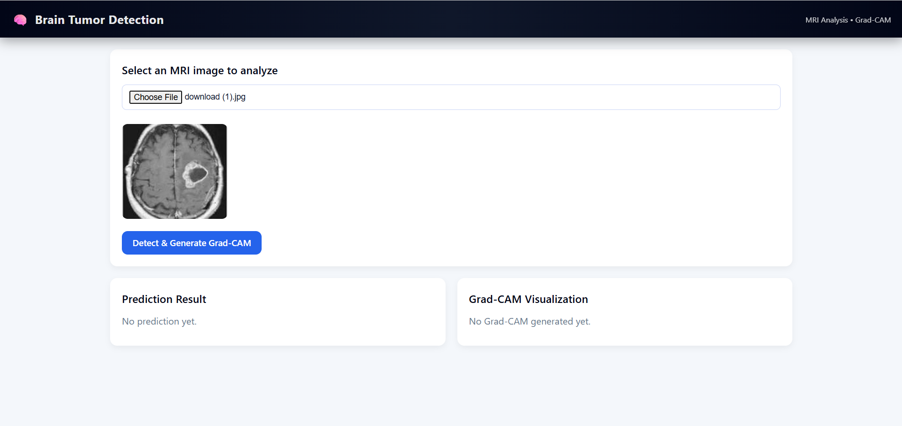
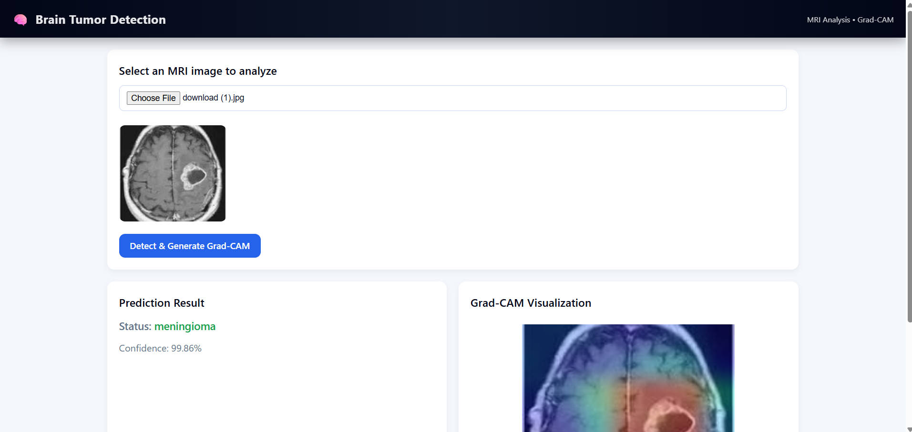

## Brain Tumor Detection with Explainable AI
Lightweight MobileNet‑based CNN with Grad‑CAM heatmaps, Flask backend, and React.js dashboard.


## Overview 
This project detects brain tumors using a lightweight CNN optimized for low‑resource systems. Grad‑CAM provides interpretable heatmaps to enhance clinical trust.


##Features

🧠 Accurate tumor classification with MobileNet

🔍 Explainability via Grad‑CAM heatmaps

⚡ Modular Flask backend

💻 React.js + Tailwind CSS dashboard


## Tech Stack
- **Frontend:** React.js, Tailwind CSS
- **Backend:** Flask, Python
- **ML:** MobileNet, Grad‑CAM, TensorFlow
- **Database/Tools:** MongoDB, Git

## Screenshots
### Dashboard


### Upload Screen


### Prediction Result


### Grad-CAM Visualization


## Demo Workflow
1. **Upload MRI Scan** → through dashboard
2. **Model Prediction** → Flask backend runs MobileNet CNN + Grad‑CAM
3. **Visualization & Download** → Dashboard shows results + heatmaps


## Run Locally

### 1. Clone the repository
```bash
git clone https://github.com/SameerInamdar26/Brain-Tumour-Detection-Using-Mobilenet.git
cd brain-tumor-detection

cd backend
pip install -r requirements.txt
python app.py

cd ../frontend
npm install
npm run dev

Access the App
Open http://localhost:5173 in browser


## Research
Published and presented at **TECHCON‑2025, National Conference on NextGen AI, SMS Varanasi (Nov 2025)**.


